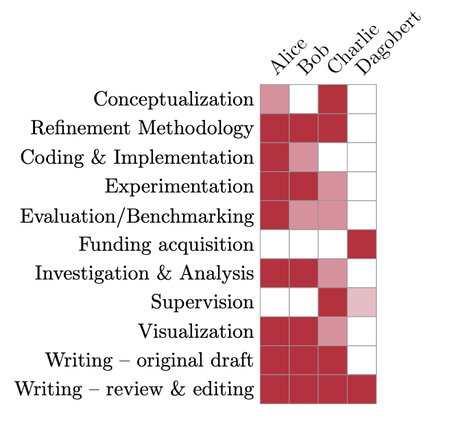

# `latex-credits-ml`: A LaTeX package for generating CRediT (Contributor Role Taxonomy) statements for ML papers

This is a simple LaTeX package for generating contributor role
statements tailored to the ML/Deep Learning field.
This is an adaptation from the [original package](https://github.com/Pseudomanifold/latex-credits)

## Installation and Usage

Download [credits.sty](credits.sty) from this repository (or clone the
whole repository) and put it in your project. You may load the package
using `\usepackage{credits}`.

## Example

The package is readily usable and permits some customisation (this
example can also be found in [example.tex](example.tex)):

```latex
\documentclass{standalone}

\usepackage{xcolor}

\definecolor{cardinal} {RGB}{196, 30, 58}
\definecolor{lightgrey}{RGB}{150,150,150}
\usepackage[role = cardinal, grid = lightgrey, ]{credits}

% The ordering of the values indicates the ordering of the 
% taxonomy, i.e.:
%
% Conceptualization
% Refinement Methodology
% Coding & Implementation
% Experimentation
% Evaluation/Benchmarking
% Funding acquisition
% Investigation & Analysis
% Supervision (e.g. weekly = 1, monthly = 0.5 etc.)
% Visualization
% Writing – original draft
% Writing – review & editing
\credit{Alice}  {1,1,1,1,1,1,1,1,1,1,1}
\credit{Bob}    {0,1,0,1,0,1,0,1,0,1,0}
% Values between 0 and 1 will be scaled to be mixed with the background
% colour (white, unless changed by TikZ). This enables giving *partial*
% credit to authors (for instance, if someone helped out initially with
% data curation, but then later went on to another project).
\credit{Charlie}{0,0.5,1,0,0,0,0,0,1,0}

\begin{document}
  \insertcredits
\end{document}
```

This results in the following output:



By passing the `horizontal` key when loading the package, you can switch
the ordering of rows and columns, essentially transposing the statement.

```latex
\usepackage[horizontal]{credits}
```

Moreover, if some of the roles are empty (i.e., no contributor) and you want
to hide them, pass the `skipempty` key:

```latex
\usepackage[skipempty]{credits}
```


If you are only interested in the textual statement, you can use the
`separator` package option to slightly adjust its formatting.

```latex
% Default: separate individual concepts/roles by a semicolon. This seems
% to be the de facto standard endorsed by many publishers.
\usepackage[separator = {;}]{credits}

% This would create a list of contributions. Personally, I do not like
% this format too much.
\usepackage[separator = {\newline}]{credits}
```

Use `\insertcreditsstatement` to place your textual statement anywhere.
Similar to the visual statement, this environment does not create a new
group or float; it can be readily added to *any* text environment. You
can find the full example in [example_text.tex](example_text.tex).


## License

The package is licensed using a BSD 3-Clause license. See [the license
file](LICENSE.md) for more information.
